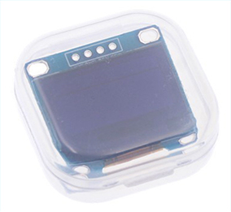
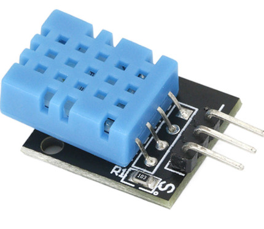
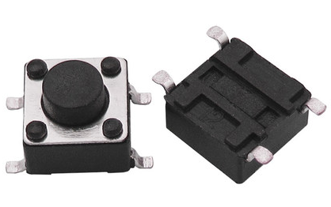

# desktopClock on ESP8266 Project

## 0 Introduce

I don't know how to write this.

## 1 Features

### 1.1 OLED Display

1. Display the loading animation.
2. Display date and time (including 24-hour and 12-hour clocks).
3. Display the temperature and humidity of the sensor.
4. Display weather information for a place (including temperature and humidity, wind level and direction, precipitation, atmospheric pressure).
5. Display menus, submenus, and options (including transition animations).
6. Display Wi-Fi connection status, data sync status and LED status.

### 1.2 Internet

1. Upload sensor's temperature and humidity data.
2. Synchronize network time and weather information.
3. Synchronize user settings and system configuration.
4. Download the firmware for update.

### 1.3 Button

1. Control the LED.
2. Switch the main UI.
3. Adjust user settings and system configuration.

### 1.4 Remote

1. Control the LED.
2. Simulate button clicks.
3. Adjust user settings and system configuration.

### 1.5 Local Storage

1. User settings and system configuration.
2. Date and time.

## 2 Instruction


This is the framework of this whole project.

1. ESP8266 can get network time and weather infomation from API Server.
2. Developer can upload the `firmware.bin` file to Web Server, and publish an upgrade message to MQTT Broker. Later ESP8266 receive the message and get the URL of `firmware.bin`.
3. ESP can upload the data to MQTT Broker. And your devices(Phone, Computer...) can receive the data from MQTT Broker via Web Client(maybe Browser).

### 2.1 Button Control


### 2.2 MQTT Topic

You can change them to your own topic in file 'desktopClock.h'.


There are **default MQTT topic** in the red box.

You also can change other default Settings in the blue box.

#### 2.2.1 esp_device/config

**Generally, you do not need to send a message to this topic. Because it's just for test.**

| Massage properties | Value |
| :----------------- | :---- |
| Retain             | false |
| QoS                | 0     |

| JSON          | Description          | Required |
| ------------- | -------------------- | -------- |
| wifiSSID      | Wi-Fi SSID           | yes      |
| wifiPASS      | Wi-Fi Password       | yes      |
| apiTimeUrl    | Network Time API URL | yes      |
| apiWeatherUrl | Weather API URL      | yes      |
| apiWeatherKey | Weather API Key      | yes      |

Example:

```json
{
    "wifiSSID": "Router-1234",
    "wifiPASS": "mypassword",
    "apiTimeUrl": "http://worldtimeapi.org/api/ip",
    "apiWeatherUrl": "http://www.eflystudio.cn/api/weather.php",
    "apiWeatherKey": "3264*********************608b"
}
```

#### 2.2.2 esp_device/control

| Massage properties | Value |
| :----------------- | :---- |
| Retain             | false |
| QoS                | 2     |

| JSON | Description                                                  | Required |
| ---- | ------------------------------------------------------------ | -------- |
| LED  | LED Control. `true`: turn on; `false`: turn off.             | no       |
| BTN  | Simulate button clicks. `LS`: Left Button Short Click; `LL`: Left Button Long Click; `RS`: Right Button Short Click; `RL`: Right Button Long Click. | no       |

Examples:

```json
{
    "LED": false,
    "BTN": "LL"
}
```

```json
{
    "LED": false
}
```

```json
{
    "BTN": "LL"
}
```

#### 2.2.3 esp_device/data

| Massage properties | Value |
| :----------------- | :---- |
| Retain             | false |
| QoS                | 0     |

| JSON | Description                                                  | Required |
| ---- | ------------------------------------------------------------ | -------- |
| temp | Sensor temperature. (Unit is defined by `weather.unit` in topic `esp_device/settings`) | yes      |
| humi | Sensor humidity. (Unit: %)                                   | yes      |

Example:

```json
{
    "temp": 26.4,
    "humi": 53
}
```

#### 2.2.4 esp_device/settings

| Massage properties | Value |
| :----------------- | :---- |
| Retain             | true  |
| QoS                | 0     |

| JSON                     | Description                                                  | Required |
| ------------------------ | ------------------------------------------------------------ | -------- |
| datetime.is24            | `true`: 24-hour clock; `false`: 12-hour clock                | yes      |
| led.sensorOn             | LED is controlled by SR602. `true`: yes; `false`: no.        | yes      |
| led.delayOffTime         | Extend the LED ON time when no movement is detected.         | yes      |
| led.buttonOnTime         | LED ON time when it is turned on by button. (if is zero, it is only turned off by button or remote) | yes      |
| led.remoteOnTime         | LED ON time when it is turned on by remote. (if is zero, it is only turned off by button or remote) | yes      |
| screen.sensorOn          | Screen can be woken up  by SR602. `true`: yes; `false`: no.  | yes      |
| screen.lockInterval      | Screen off time when no action.                              | yes      |
| screen.scrollInterval    | Screen scroll time when no action.                           | yes      |
| sync.dataSyncInterval    | Sensor data synchronization interval.                        | yes      |
| sync.clockSyncInterval   | Network time synchronization interval.                       | yes      |
| sync.weatherSyncInterval | Weather information synchronization interval.                | yes      |
| weather.unit             | Weather temperature and sensor temperature units.`true`: Celsius; `false`: Fahrenheit. | yes      |
| weather.city             | Get the weather information of `weather.city`. More about: [Real-time Weather - API](https://dev.qweather.com/en/docs/api/weather/weather-now/) | yes      |
| weather.cityID           | Location ID of `weather.city`. More about: [City Lookup - API](https://dev.qweather.com/en/docs/api/geo/city-lookup/) | yes      |

Example:

```json
{
    "datetime": {
        "is24": true
    },
    "led": {
        "sensorOn": true,
        "delayOffTime": 0,
        "buttonOnTime": 5,
        "remoteOnTime": 10
    },
    "screen": {
        "sensorOn": false,
        "lockInterval": 0,
        "scrollInterval": 0
    },
    "sync": {
        "dataSyncInterval": 0,
        "clockSyncInterval": 15,
        "weatherSyncInterval": 15
    },
    "weather": {
        "unit": true,
        "city": "Changchun",
        "cityID": "101060101"
    }
}
```

#### 2.2.5 esp_device/status

| Massage properties | Value |
| :----------------- | :---- |
| Retain             | true  |
| QoS                | 0     |

| JSON   | Description                                             | Required |
| ------ | ------------------------------------------------------- | -------- |
| online | Device online status. `true`: online; `false`: offline. | yes      |

Example:

```json
{
    "online": true
}
```

#### 2.2.6 esp_device/upgrade

| Massage properties | Value |
| :----------------- | :---- |
| Retain             | false |
| QoS                | 2     |

| JSON       | Description                                         | Required |
| ---------- | --------------------------------------------------- | -------- |
| forced     | Force update immediately. `true`: yes; `false`: no. | yes      |
| version    | The version of latest firmware.                     | yes      |
| upgradeUrl | URL of latest firmware.                             | yes      |

Example:

```json
{
    "forced": false,
    "version": 1304,
    "upgradeUrl": "http://www.eflystudio.cn/firmware.bin",
}
```

#### 2.2.7 server/status

| Massage properties | Value |
| :----------------- | :---- |
| Retain             | false |
| QoS                | 0     |

| JSON   | Description                                                  | Required |
| ------ | ------------------------------------------------------------ | -------- |
| online | Server online status. `true`: online; `false`: offline. Data is sent to topic `esp_device/data` only when the server is online. | yes      |

Example:

```json
{
    "online": false
}
```

### 2.3 Upgrade

#### 2.3.1 Change the `SKETCH_VERSION` bigger and Get the .bin file


#### 2.3.2 Upload to Web Server and Get the URL

Your don't necessarily need a Web Server, as long as you can surely that ESP8266 can get the `fireware.bin` file through the URL. (only support HTTP protocol).

#### 2.3.3 Publish an upgrade message to MQTT Broker

Publish an upgrade message to MQTT Broker.

Example:

```json
{
    "forced": false,
    "version": 1306,
    "upgradeUrl": "http://example.com/example.bin",
}
```

if `forced` is true, it will auto upgrade immediately when ESP8266 receive this message.

if `forced` is false, you can select `System->upgrade` to upgrade manually. 

## 3 Requirements

### 3.1 Web Server (or MQTT Client)


You can get the source code of this web from [here](https://github.com/MoFChen/desktopClock-web).

I've removed the API Key. So, you may need to apply for your own API Key from [here](https://dev.qweather.com/en/docs/resource/get-key/)

### 3.2 MQTT Broker

default MQTT Broker Host: `www.eflystudio.cn`

default MQTT Broker Port: 1883

### 3.3 Hardware

#### 3.3.1 NodeMCU ESP8266 Development Board


#### 3.3.2 SSD1306 I²C OLED Display Module




#### 3.3.3 SR602 Motion Sensor Detector Module


#### 3.3.4 DHT11/22 Temperature and Humidity Sensor Module

##### DHT11



##### DHT22


#### 3.3.5 LED Module


Any color should be ok.

#### 3.3.6 Button



2 * buttons

##### 3.3.7 Connection


### 3.4 Software

1. Arduino with ESP8266 Development environment
2. Visual Studio Code (unessential, but recommended)

### 3.5 Arduino Library

1. [`DHT-sensor-library`](https://github.com/adafruit/DHT-sensor-library)
2. [`esp8266-oled-ssd1306`](https://github.com/MoFChen/esp8266-oled-ssd1306)
3. [`ArduinoJson`](https://github.com/bblanchon/ArduinoJson)
4. [`ESPAsyncTCP v1.2.2+`](https://github.com/me-no-dev/ESPAsyncTCP)
5. [`AsyncHTTPRequest_Generic`](https://github.com/khoih-prog/AsyncHTTPRequest_Generic)
6. [`AsyncMQTT_Generic`](https://github.com/khoih-prog/AsyncMQTT_Generic)
